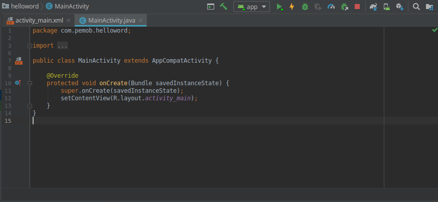
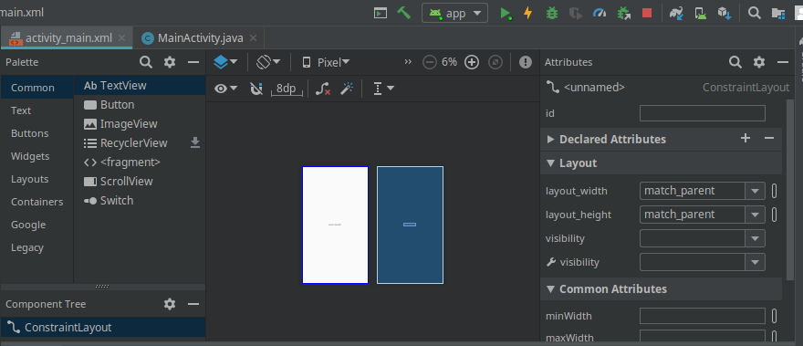
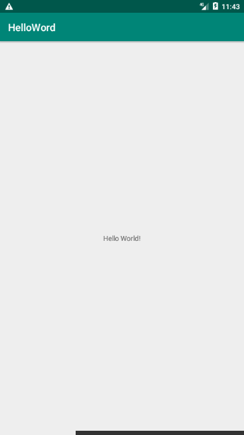

# TUGAS HELLOWORD
## Menggunakan Android Studio 
### Program Hello Word

* (berisi penjelasan percobaan 1. Jika ada rujukan ke file program, bisa dibuat linknya di sini.)

` ScreenShot`

``

``

 link kode program: 
 
 [Code Program 1](../../SRC/01_HelloWord/activity_main.xml)

 [Code Program 2](../../SRC/01_HelloWord/MainActivity.java)
