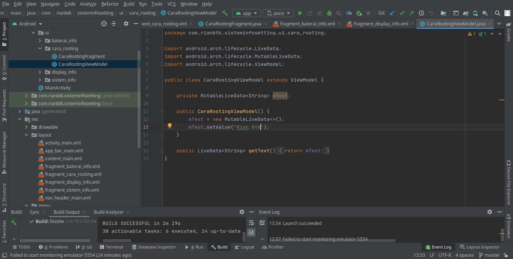
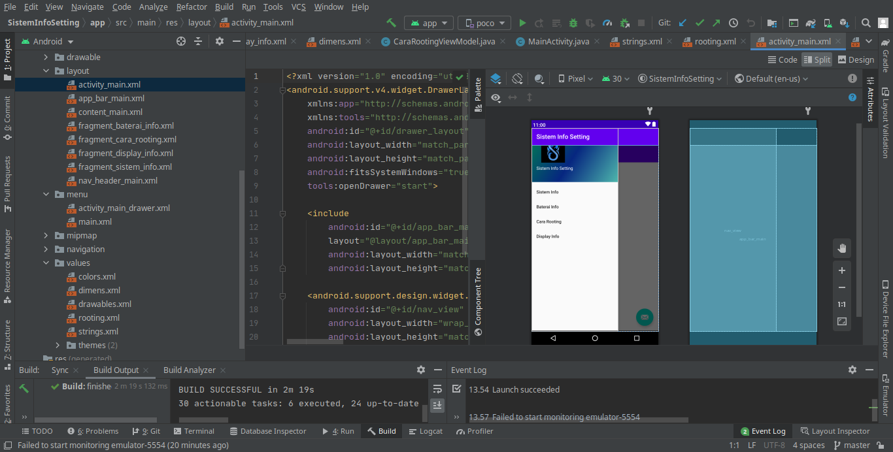
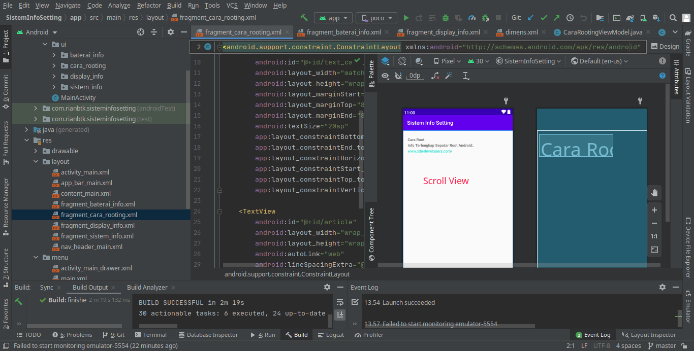
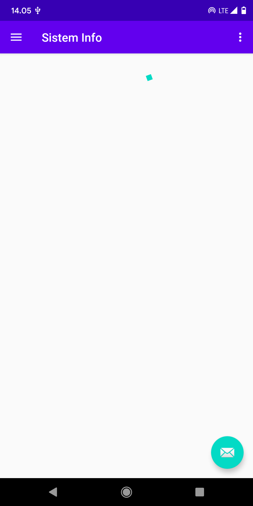
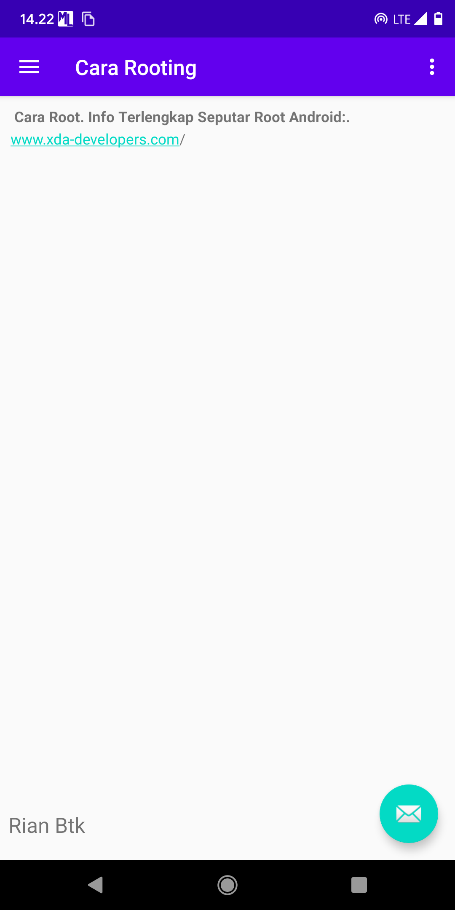
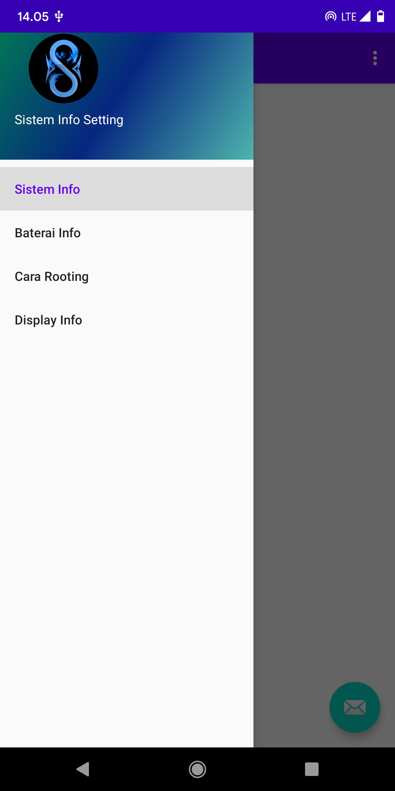
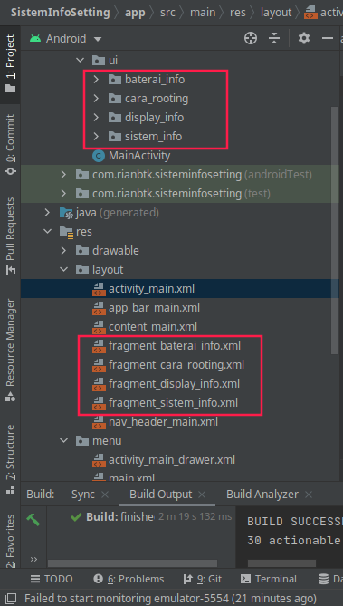

### Screenshot

### 1

`*`
 
`*`
 
`*`
 
`*`
 
`*`
 
`*`
 
`*`
 

### 2. 
    Perbedaan data binding dengan view model adalah data binding memungkinkan mengikat komponen UI dalam tata letak ke sumber data di aplikasi menggunakan format deklaratif,
    bukan secara terprogram. Dengan mengikat komponen dalam file tata letak dapat menghapus banyak panggilan framework UI dalam aktivitas,yang menjadikannya lebih sederhana dan lebih mudah dikelola. 
    Hal ini juga dapat meningkatkan performa aplikasi dan membantu mencegah kebocoran memori dan pengecualian pointer null.(referensi : modul library binding)
    Data binding sama dengan view model hanya saja penerapannya lebih sederhana denga performa yang lebih baik.
    Data binding dan view model digunakan ketika untuk menyimpan dan mengelola data terkait UI

### 3 
    Perbedaan fragment dan activity adalah dapat mengombinasikan beberapa fragmen dalam beberapa activity untuk membangun UI.
    dan menggunakan kembali sebuah fragmen dalam beberapa activity.
    Fragment dan activity digunakan disaat membangun layout XML dan kelas java (referensi : modul fragment)

`Perbedaanya`