# Nama Aplikasi

    Nama APlikasi : Sistem Info Setting
    Bahasa APlikasi : Java

 link APlikasi: [Sistem Info Setting](apk/app-debug.apk)

# Deskripsi Aplikasi

    Aplikasi Ini digunakan untuk merubah sistem informasi pada android (Root) dan hanya bisa di gunakan oleh divices yang sudah Root.
    Pada dasarnya informasi interface android di muat di System/build.prop dimana build.prop merupakan tempat untuk mensetting mulai dari Tampilan hingga sistem antarmuka pada android

# Indentitas Pengembang (Developer)

    Nim : 1941723007
    Nama / Pengembang : Agus Salim Hadjrianto

# Fitur-fitur Aplikasi

Fiture Restore : Fiture ini digunakan untuk mengembalikan data yang telah dirubah sebelumnya

`Restored`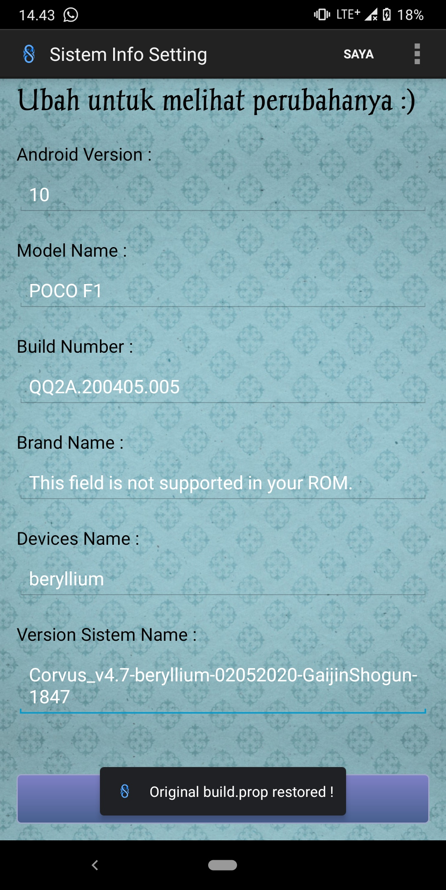

 

Fiture Edit : Digunakan untuk mengedit file sesuai view yang di tampilkan

`Edit`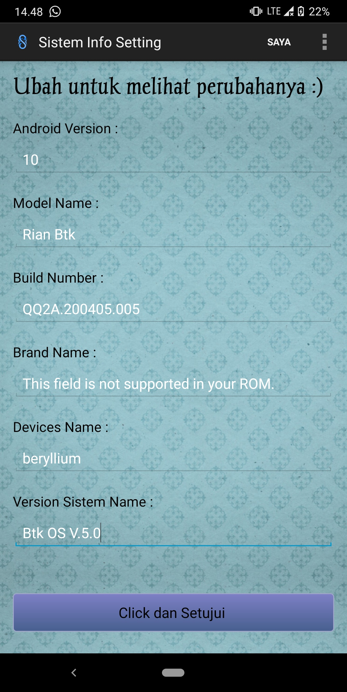

 

`restart`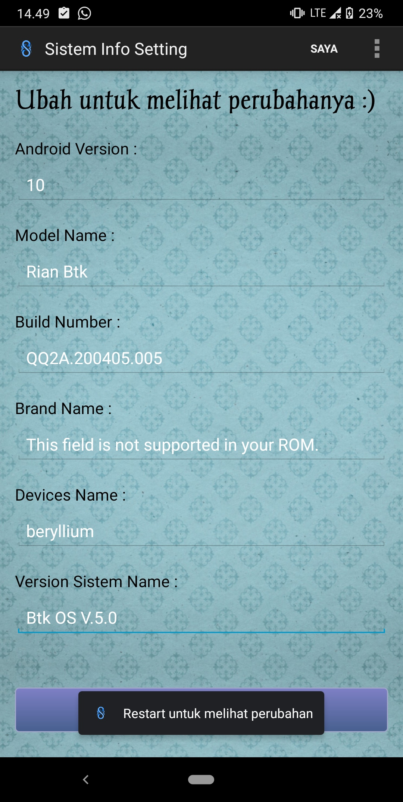

 

`Directory`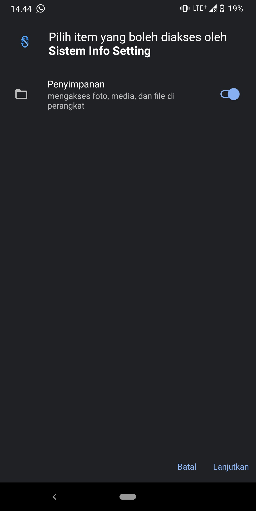

 

Fiture View : Digunakan untuk menampilkan informasi system

`Root`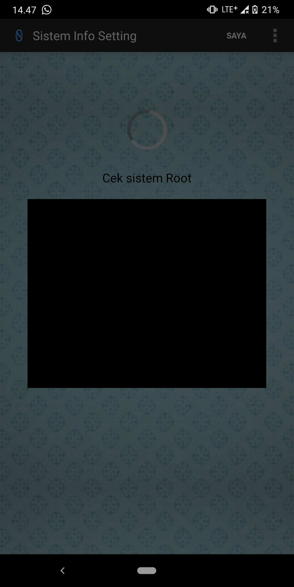

 

`View`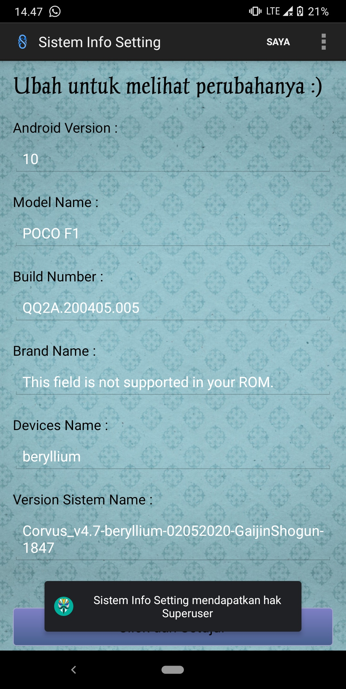

 

Fiture Saya : Digunakan untuk menampilkan informasi deri pengembang

`Saya`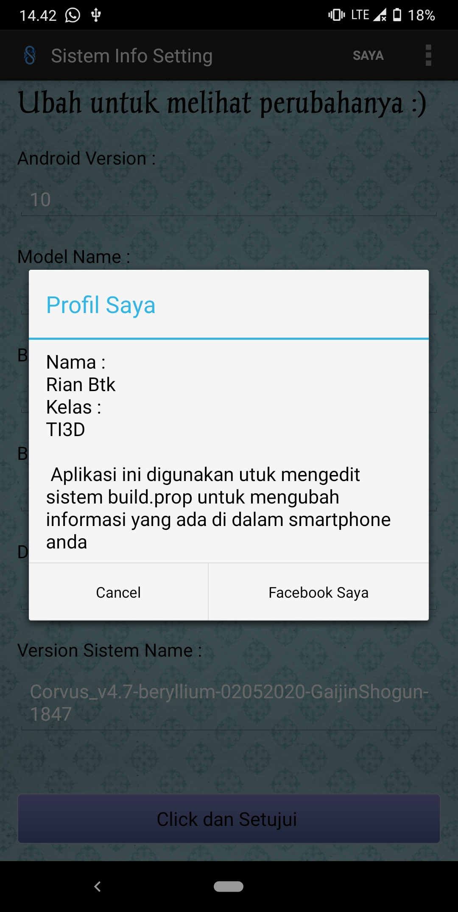

 

`Link`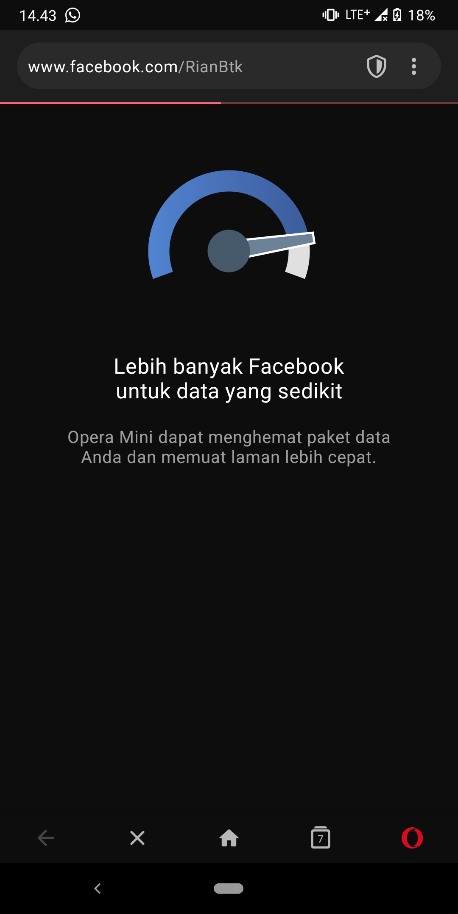

 

Splash Screen 

`Splash`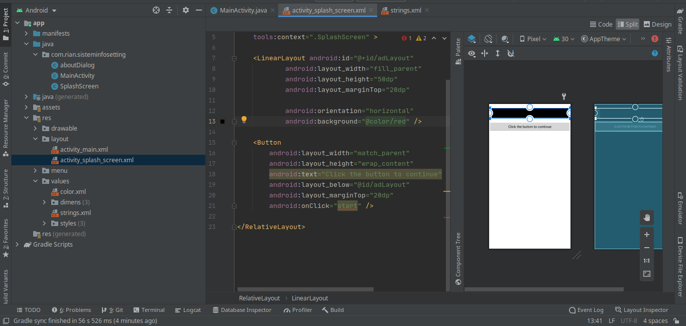

 

`Screen`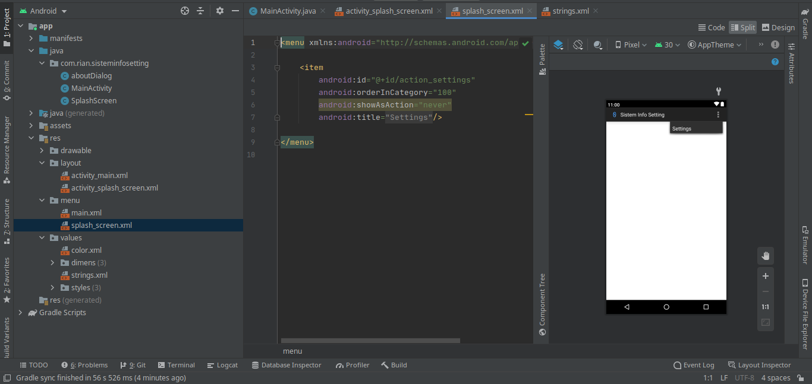

 

Hasil : 

`Hasil 1`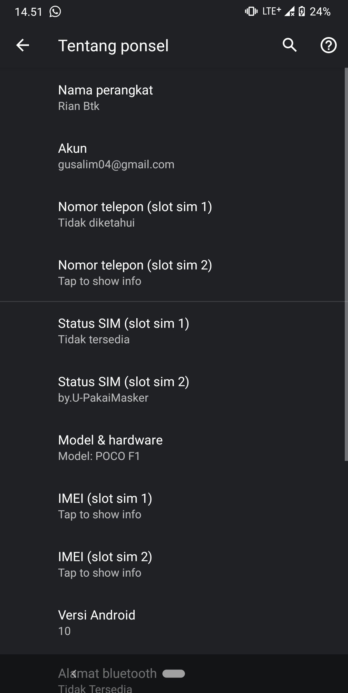

 

`Hasil 2`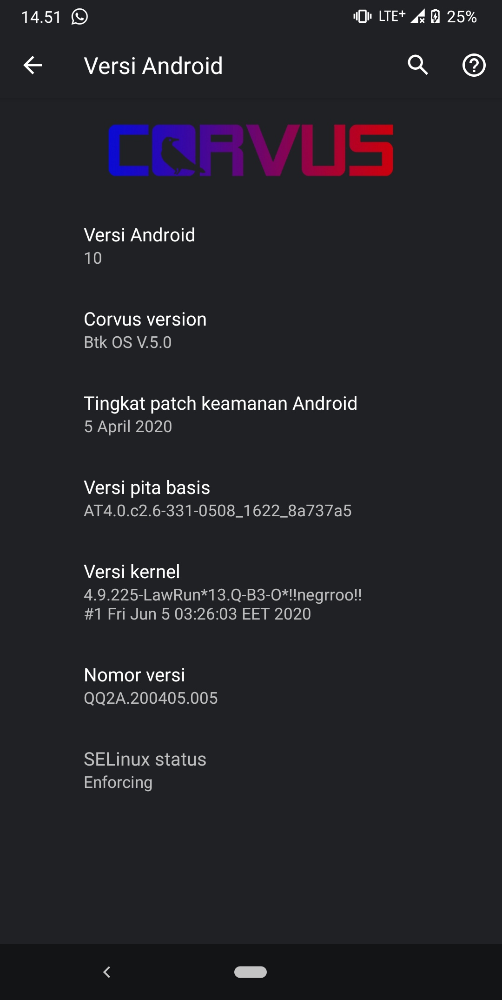

 

# Saran

    Saran utuk developer selanjutnya untuk memperbanyak view an editing dari system

# Kesimpulan

    Alhamdulillah saya mempelajari banyak pelajaran dalam pengerjaan aplikasi ini , dimana dalam menampilkan sistem yang root (Terenkripsi) tidak semudah yang saya fikirkan di awal perencanaan dimana minimnya tutorial yang ada mengenai aplikasi yang berbasis ROOT . 

Sumber Data/Referensi

    Sumber data aplikasi ini adalah build prop editor yang di kembangkan oleh developer JRumy Apps