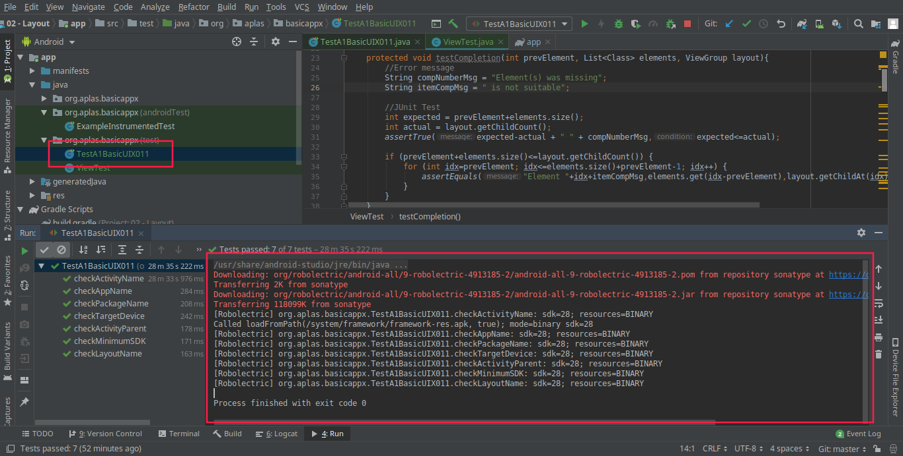

# Layout

## 02 - Layout

### Membuat layout di Android Studio

### TASK GUIDE (A1X.01)
1. <b>`Pertama kita buat project baru di adnroid studio`

`Maka akan keluar tampilan awal di android studio  sebagai berikut`

</b>

 

2. <b>`Mengganti build.graddle (Module: app), Hapus file ExampleUnitTest in org.aplas.basicapp (test), Jalankan dan Running file TestA1BasicUI011X`

</b>

### TASK GUIDE (A1X.02)

1. `Buat folder "font" di bawah folder "res". Klik kanan pada folder "res" dan pilih New –Adroid Resource Directory ` 
   
 `Copy file font`  
   
 `Edit Strings dan Color pada res/values`  
   
   
   
 `Copy TestA1BasicUIX021.java dan ResourceTest.java`  
   
 `Running TestA1BasicUIX021`  
   

 ### TASK GUIDE (A1X.03)

 1. Pertama buka project di android studio
    setelah itu ganti " ConstraintLayout "  dengan RelativeLayout lalu tambahkan TextView dan Button
    lalu masukan code sesuaipada module 

 `RelativeLayout`
 `TextView`
 `Button`
 
  

Lalu copy TestA1BasicUIX031 ke org.aplas.basicappx untuk Testing

`Hasil test TestA1BasicUIX031`  

`Hasil Layout`  

 ### TASK GUIDE (A1X.04)

 `Hasil view`

 `Hasil Testing`

### TASK GUIDE (A1X.05)

 `View Prject`

 

 `Hasil Result`  
 

 `Hasil Testing`

### TASK GUIDE (A1X.06)

 `View Prject`

 `Hasil Result`  
 

 `Hasil Testing`

 ### TASK GUIDE (A1X.07)

 `View Prject`

 `Hasil Result`  
 

 `Hasil Testing`

  ### TASK GUIDE (A1X.08)