# BasicActivity

## B1-BasicActivity(withAndroidX)

### B1X.01 Guide

`Hasil Testing`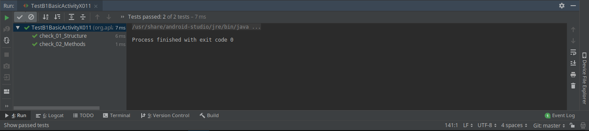

### B1X.02 Guide

`Hasil Testing`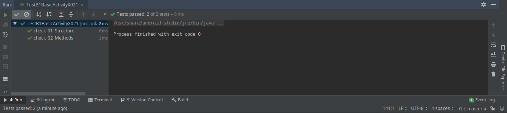

### B1X.03 Guide

`Hasil Testing`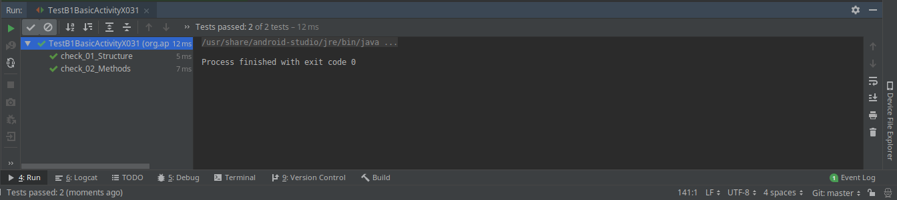

### B1X.04 Guide

`Hasil Testing`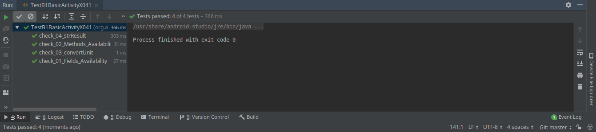

### B1X.05 Guide

`Hasil Testing`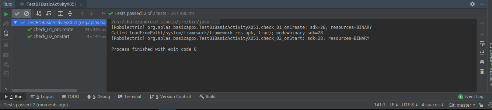

### B1X.06 Guide

`Hasil Testing`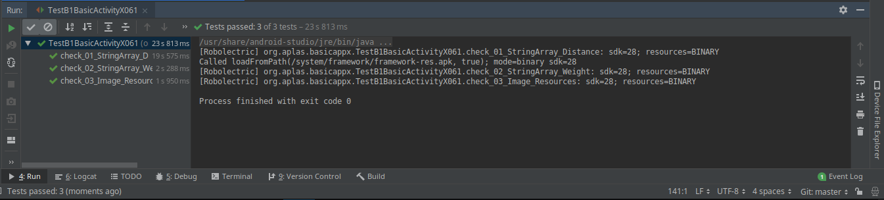

 

`Hasil Testing`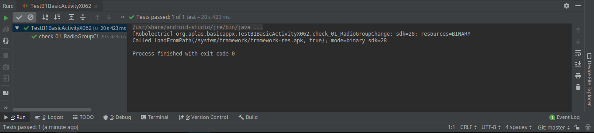

### B1X.07 Guide

`Hasil Testing`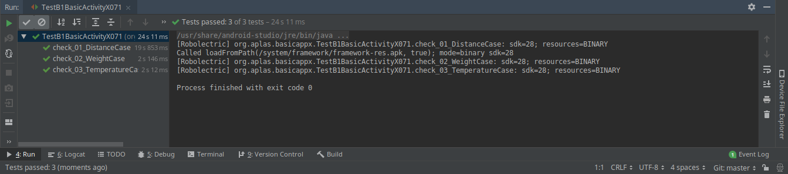

### B1X.08 Guide

`Hasil Testing`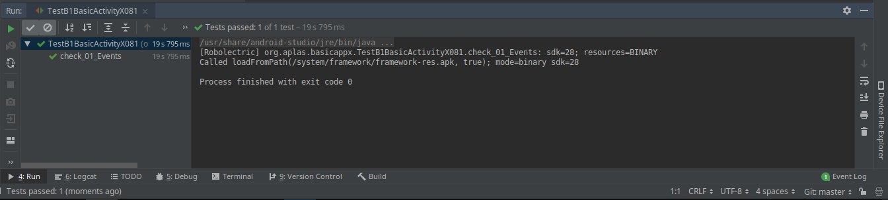

### B1X.09 Guide

`Hasil Testing`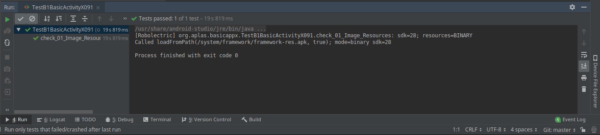

 

`Hasil Testing`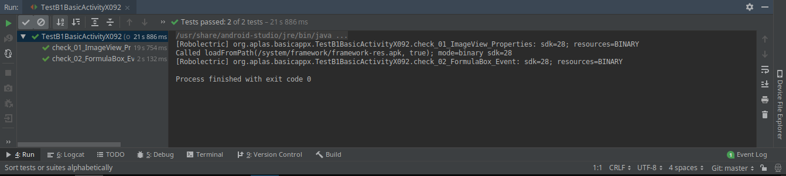

### Tampilan

`Tampilan Awal`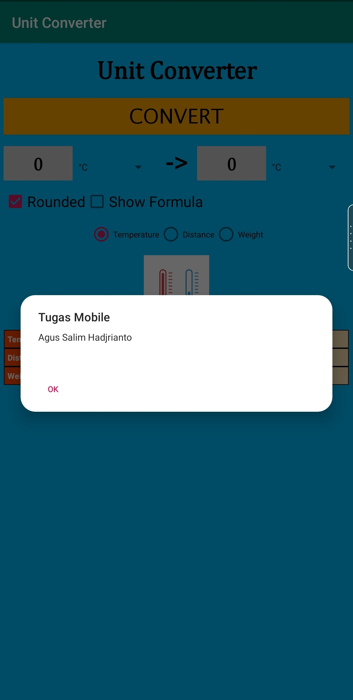

`Distance`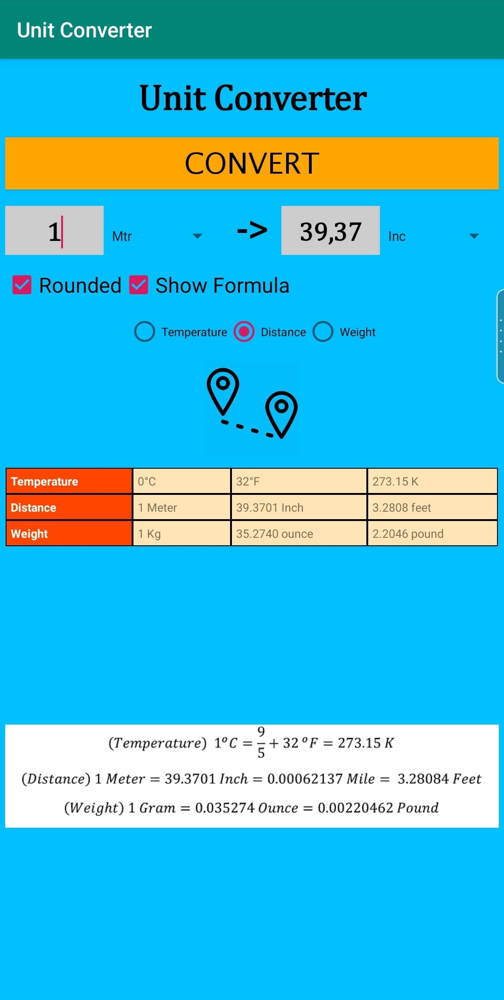

`Temperatur`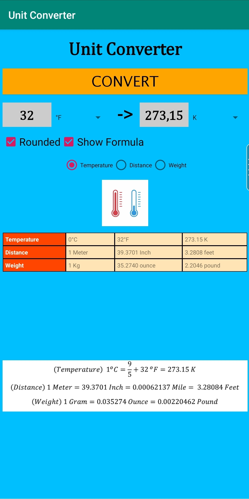

`Hasil Testing`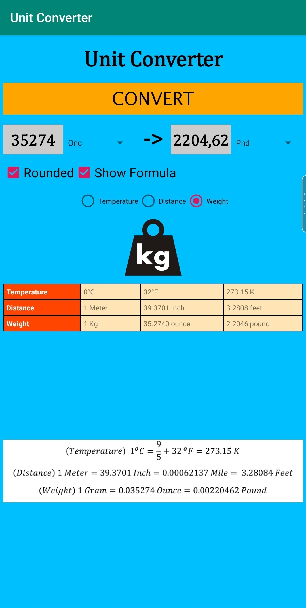