# AdvancedWidgets

## 04 = B2 aplas

## B2-AdvancedWidgets

### B2X.01 Guide

`Hasil Testing`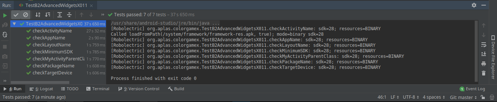

### B2X.02 Guide

`Hasil Testing`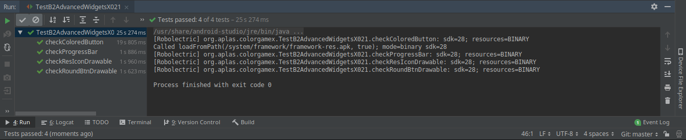

### B2X.03 Guide

`Hasil Testing`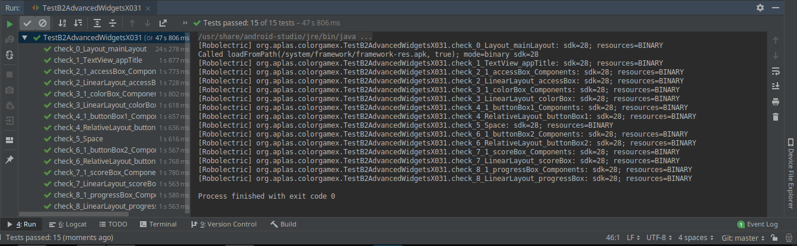

### B2X.04 Guide

`Hasil Testing`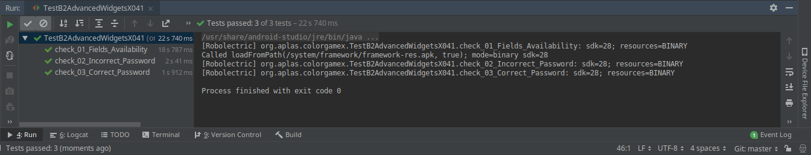

### B2X.05 Guide

`Hasil Testing`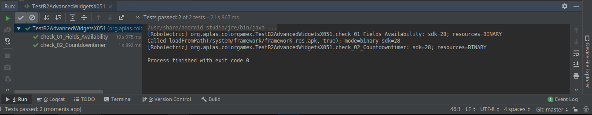

### B2X.06 Guide

`Hasil Testing`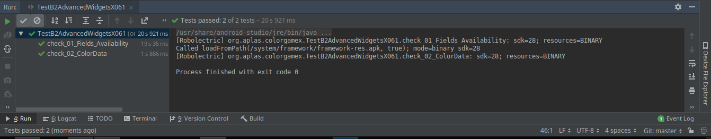

### B2X.07 Guide

`Hasil Testing`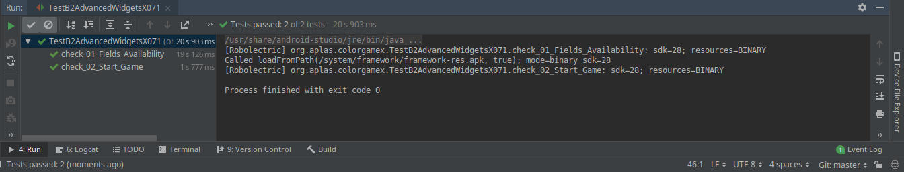

### B2X.08 Guide

`Hasil Testing`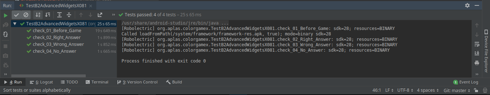

### Dokumentasi Aplikasi

`Jika Folder project android studio kita rename maka file pun akan otomatis terhapus, sebagai pengalaman saya maka jangan rename folder project`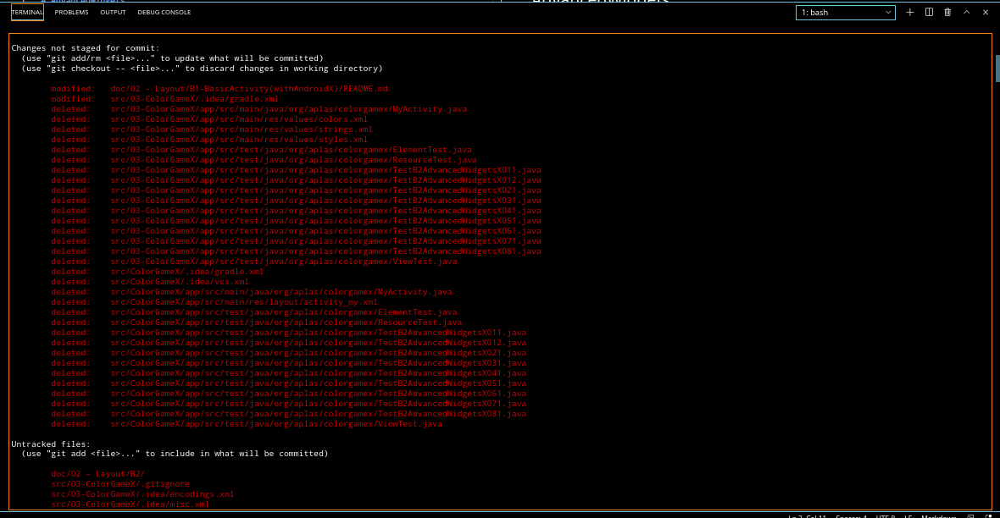

### Tampilan

`Tampilan Awal`

 

`Setelah Login`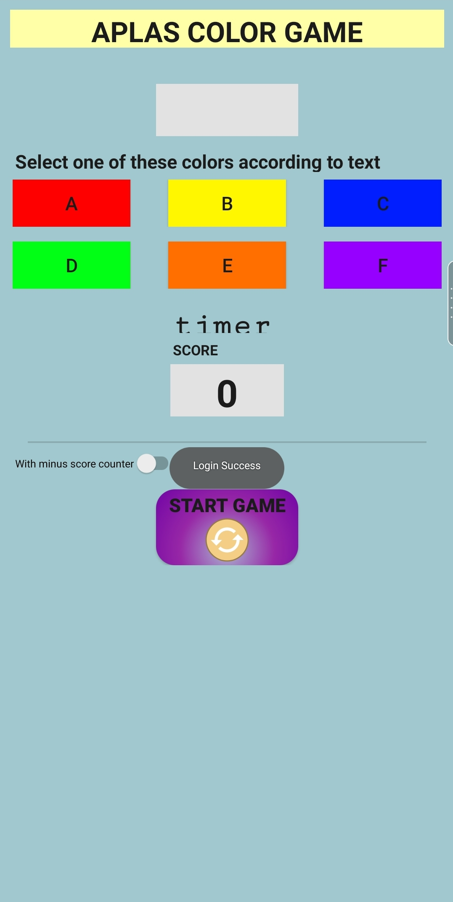

 

`Game Play`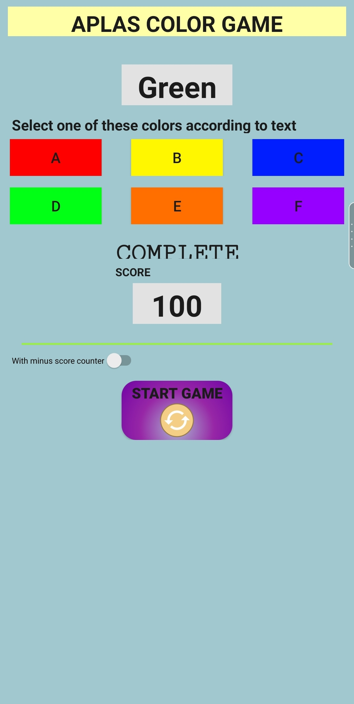