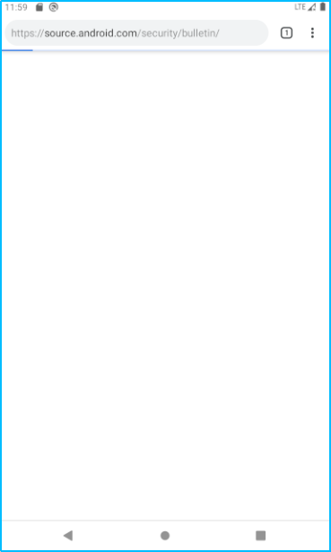

# ScrollView

## 05 = Scrollview

### Capaian Pembelajaran:

### Setelah mempelajari materi ini, Anda diharapkan mampu:

    menangani interaksi pengguna;
    membuat aplikasi yang menggunakan Input Keyboard;
    membuat aplikasi dengan alert dialog;
    membuat aplikasi menggunakan picker;
    membuat aplikasi dengan radio button dan option menu.

## Screenshoot

`Activity`

 

`String`

 

`Style`

 

`Color`

 

`Tampilan`

 

`Hasil`

``

 

`Link`

 

