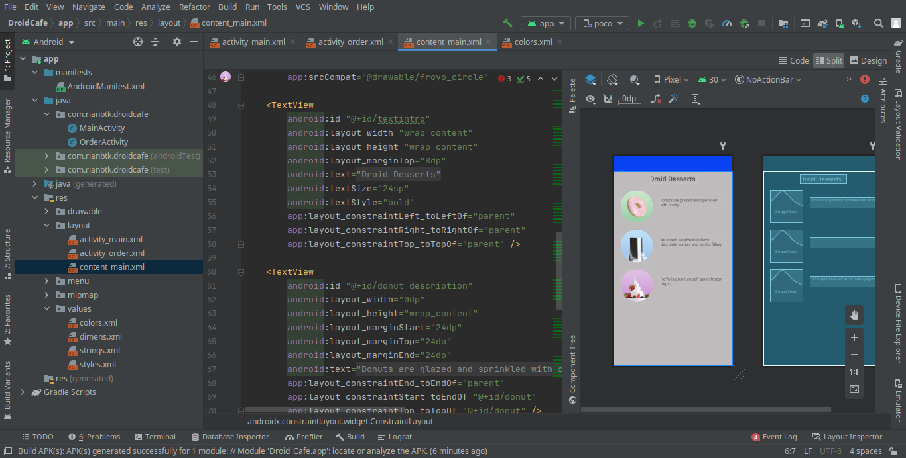
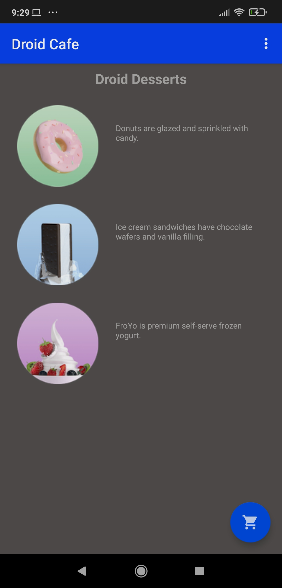
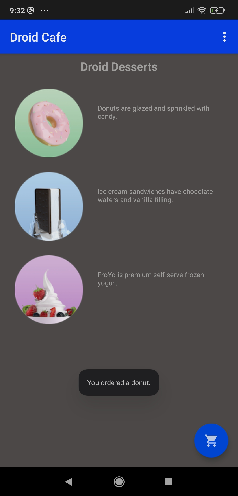
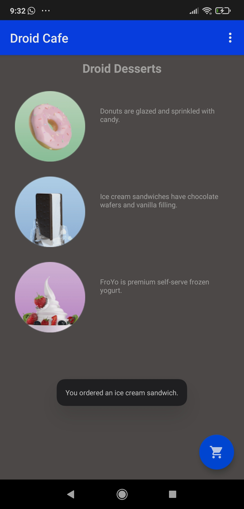
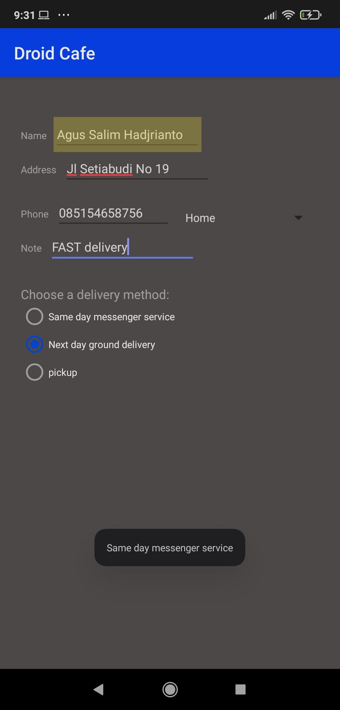
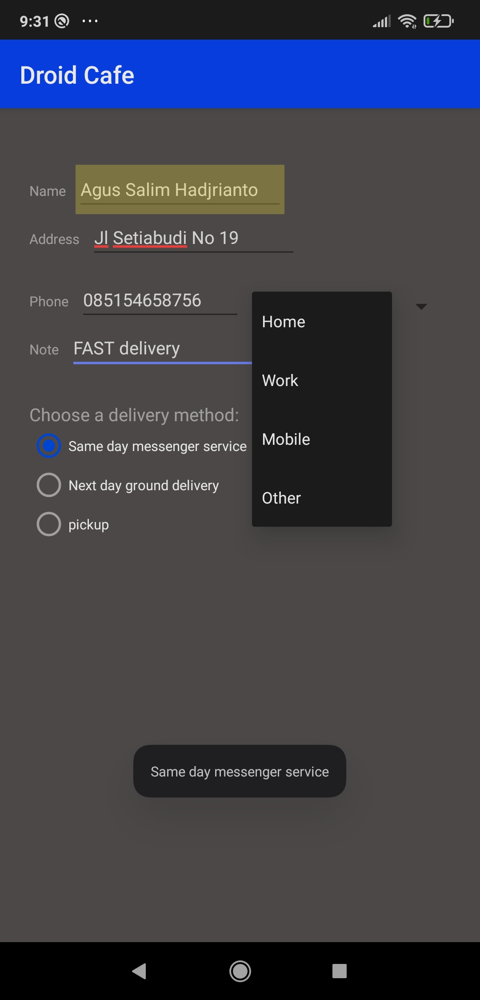
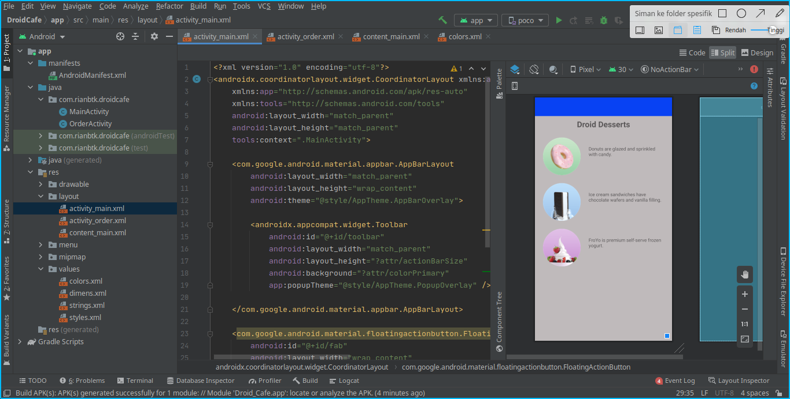
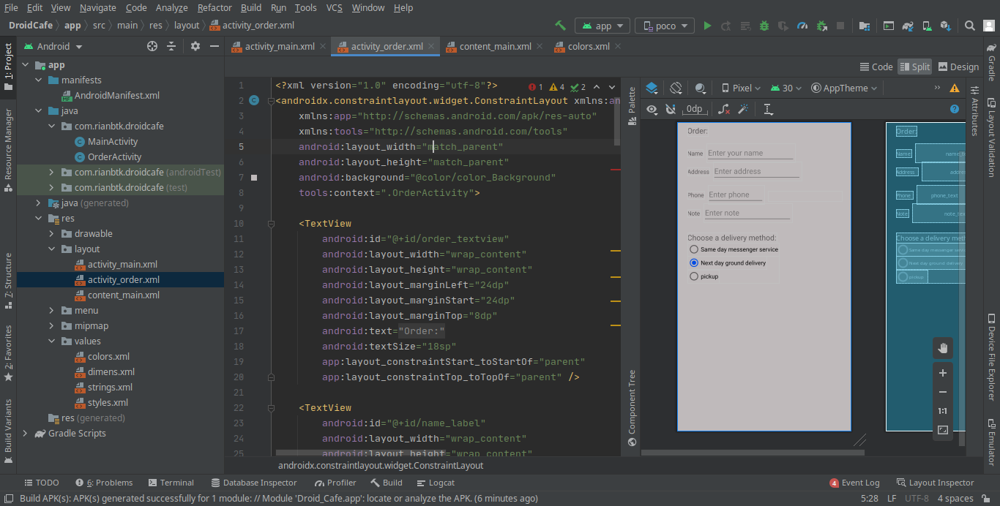

### Capaian Pembelajaran:

## Setelah mempelajari materi ini, Anda diharapkan mampu:

    menangani interaksi pengguna;
    membuat aplikasi yang menggunakan Input Keyboard;
    membuat aplikasi dengan alert dialog;
    membuat aplikasi menggunakan picker;
    membuat aplikasi dengan radio button dan option menu.

## Input ControlURL

    Pada praktikum codelabs ini, Anda akan belajar menerapkan input method untuk saran kata, auto-capital, password obfuscation, mengubah generic on-screen keyboard ke keypad keyboard, menambahkan radio button, dan membuat spinner untuk drop-down menu.

## Screenshoot

`Main`

 

`Tampilan`

 

`Tampilan`

 

`Tampilan`

 

`Tampilan`

 

`Tampilan`

 

`Tampilan`

 

``

 

`Order`

 