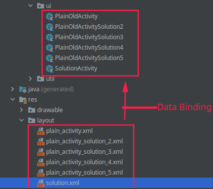
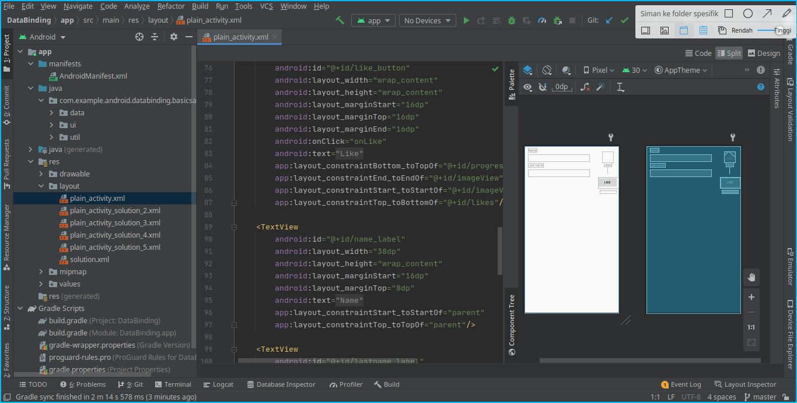
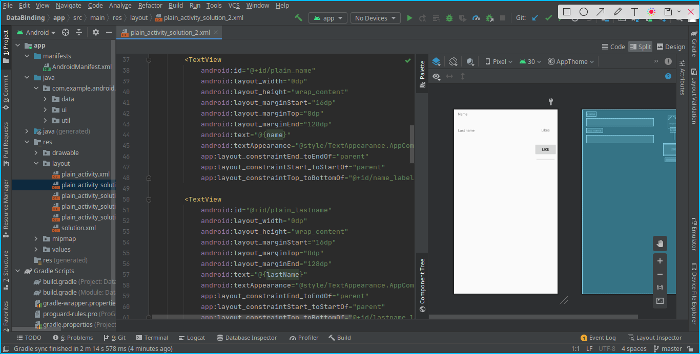
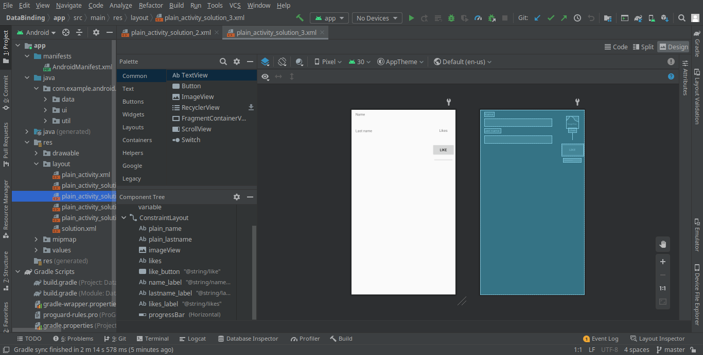
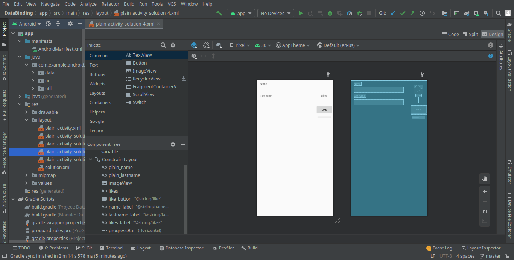
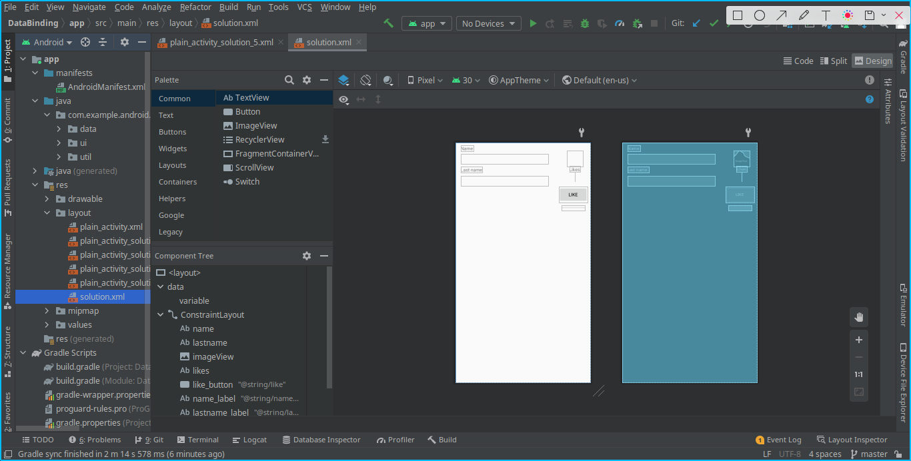
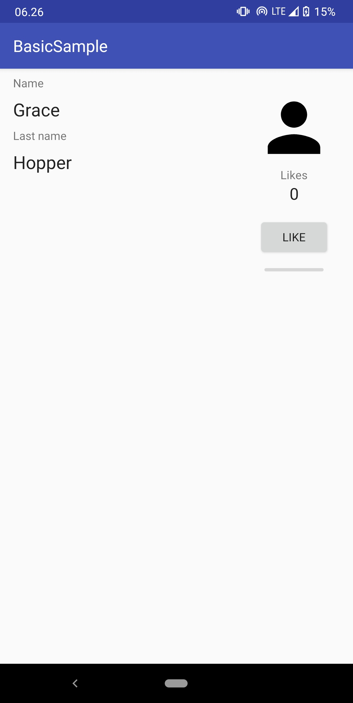
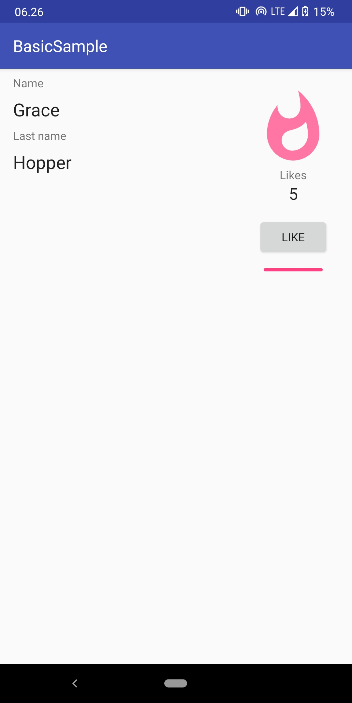

# 09: Data Binding

## Capaian Pembelajaran:

    Setelah mempelajari materi ini, Anda diharapkan mampu:

    melakukan konfigurasi data binding pada project Android;
    menerapkan data binding pada project Android.

### Data Binding di Android StudioFile

    Library Data Binding adalah support library yang memungkinkan Anda mengikat komponen UI dalam tata letak ke sumber data di aplikasi Anda menggunakan format deklaratif, bukan secara terprogram. Tata letak sering ditentukan dalam aktivitas dengan kode yang memanggil metode framework UI.

## Screenshoot

`Keterangan`

 

`Plain`

 

`Plain`

 

`Plain`

 

`Plain`

 

`Plain`

 

`Solution`

 

`Hasil`

 

`Hasil`

 

`Hasil`

 