# 8 - Multi Activities

    Tujuan Pembelajaran
    Setelah mempelajari materi ini, Anda diharapkan mampu:

    melakukan perpindahan activity dalam aplikasi android.
    menerapkan beberapa activity pada project Android.

## Screenshoot

`Test11`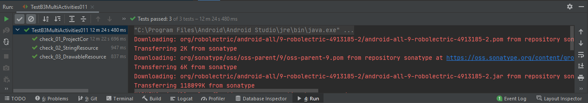

 

`Test21`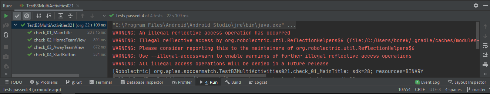

 

`Test31`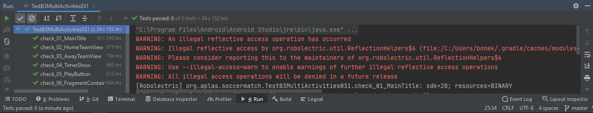

 
`TEst41`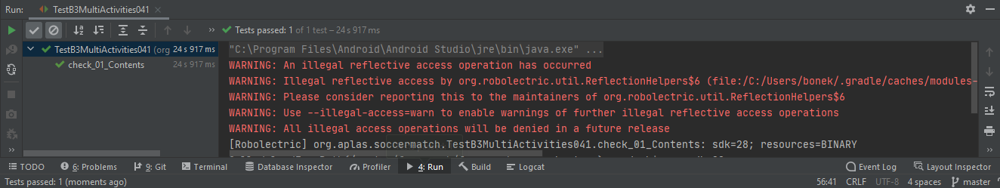

 

`Test51`

 

`Test61`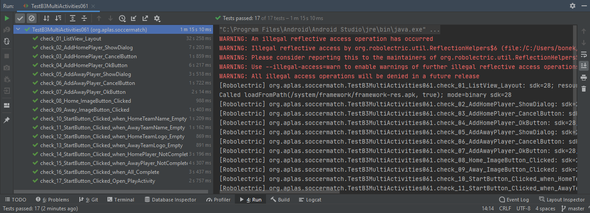

 

`Test71`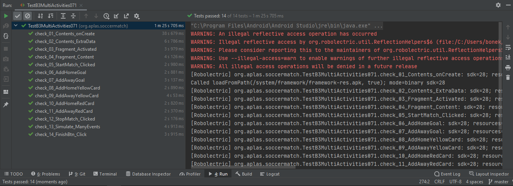

 

`Test81`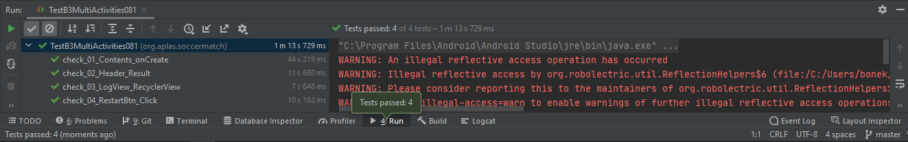

 

`Tampilan`

 

`Tampilan`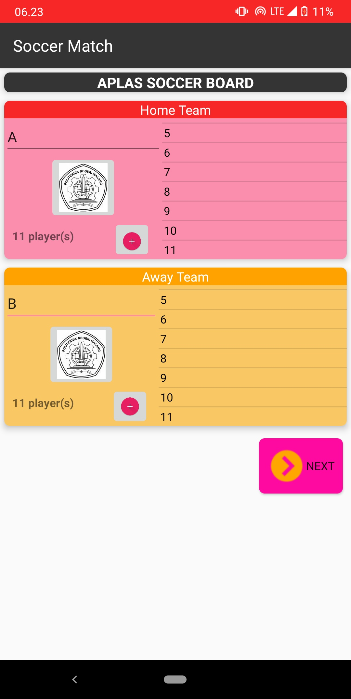

 

`Tampilan`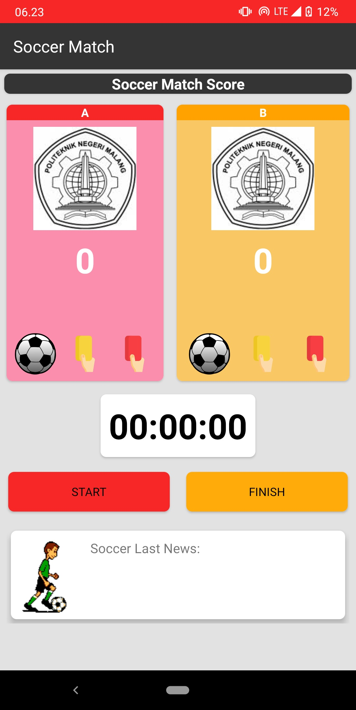

 

`Tampilan`

 

`Tampilan`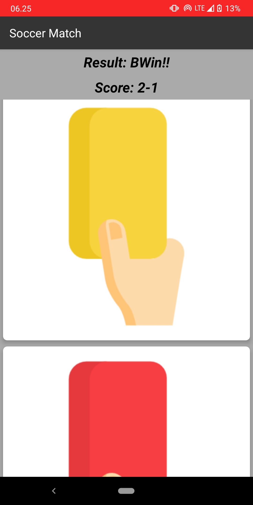

 

`Tampilan`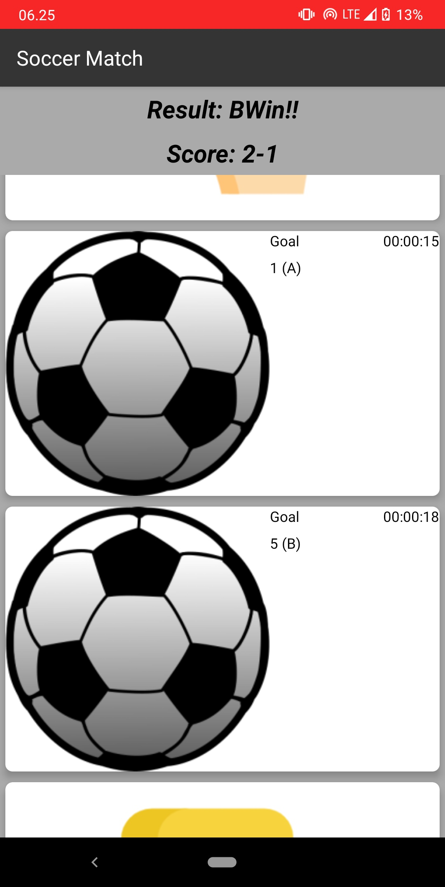

 

`Tampilan`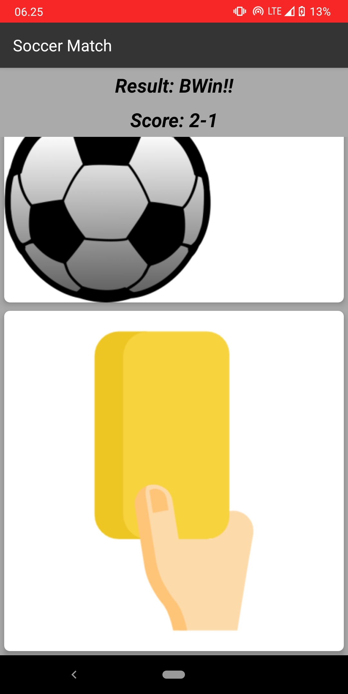

 