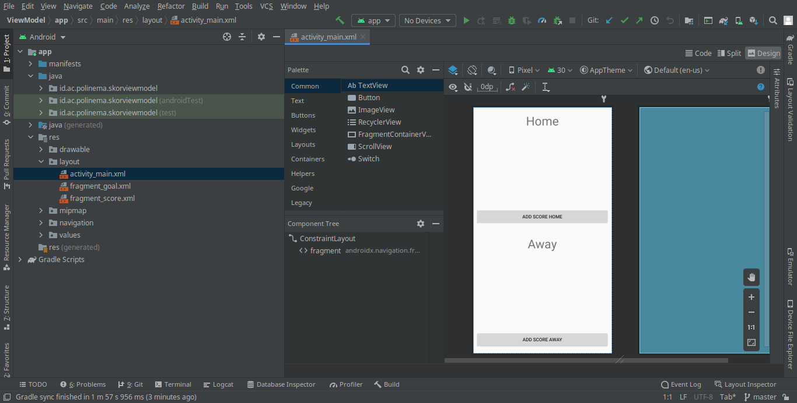

# 11: Lifecycle View Model

    Capaian Pembelajaran:

    Setelah mempelajari materi ini, Anda diharapkan mampu:

    mengenal tentang arsitektur MVVM;
    menjelaskan lifecycle view model pada MVVM;
    menerapkan view model pada android.

## Screenshoot

`Activity`

 

`Fragment`

 

`Fragmen`

 

`Input`

 

`Output`

 