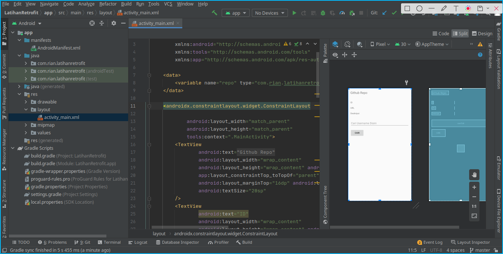
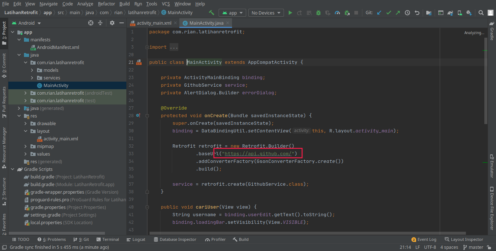
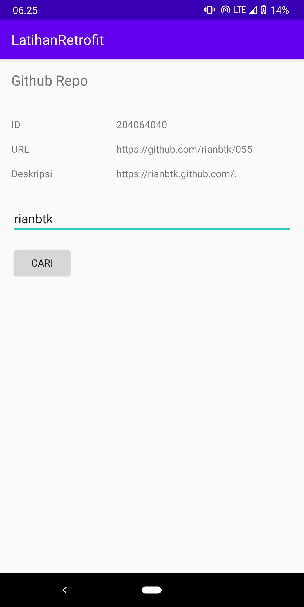

# 10: REST API dan Retrofit
    
    Capaian Pembelajaran:

    Setelah mempelajari materi ini, Anda diharapkan mampu:

    mengonfigurasi Retrofit pada Android;
    melakukan request ke RESTful API menggunakan Retrofit.

## Screenshoot

`Activity`

 

`API`

 

`Hasil`

 